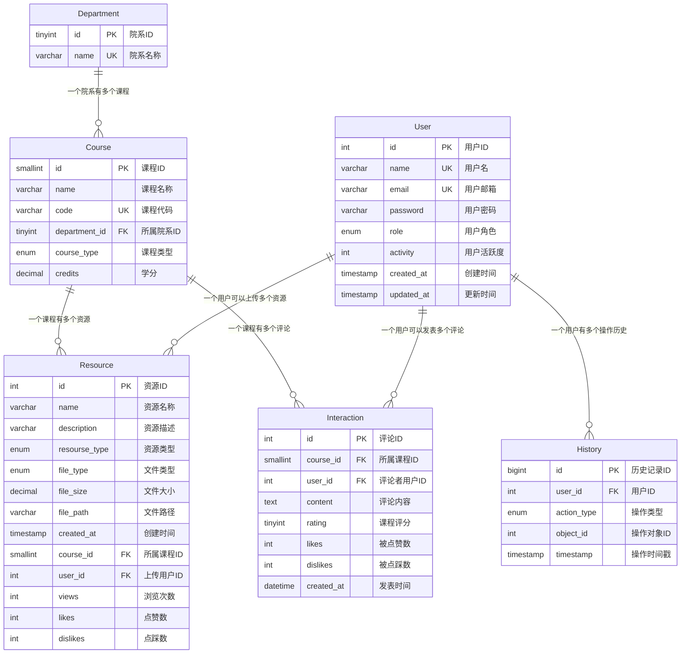

# OpenCourse 数据库表设计文档

本文档为 OpenCourse 团队数据库表设计文档，主要记录数据库表的定义和说明信息，用于开发时参考使用

## Department

院系信息表，存储院系相关信息

```sql
create table `Department` if not exists (
    `id` tinyint auto_increment primary key,
    `name` varchar(31) not null unique
) engine=InnoDB default charset=utf8mb4 collate=utf8mb4_unicode_ci;
```

|   字段   |       含义       |
|:--------:|:---------------:|
| `id`     | 院系 ID          |
| `name`   | 院系名称         |

## Course

课程信息表，存储课程相关信息

```sql
create table `Course` if not exists (
    `id` smallint primary key auto_increment,
    `name` varchar(31) not null,
    `code` varchar(31) unique not null,
    `department_id` tinyint not null,
    `course_type` enum(
        'GENERAL_REQUIRED',
        'GENERAL_OPTIONAL',
        'MAJOR_REQUIRED',
        'MAJOR_OPTIONAL'
    ) not null,
    `credits` decimal(3, 1) not null,
    foreign key (`department_id`) references `Department`(`id`)
) engine=InnoDB default charset=utf8mb4 collate=utf8mb4_unicode_ci;
```

|      字段      |       含义       |
|:--------------:|:---------------:|
| `id`           | 课程 ID          |
| `name`         | 课程名称         |
| `code`         | 课程代码         |
| `department_id`| 所属院系 ID      |
| `course_type`  | 课程类型         |
| `credits`      | 学分             |

## User

用户信息表，存储用户相关信息

```sql
create table `User` if not exists (
    `id` int auto_increment primary key,
    `name` varchar(31) not null unique,
    `email` varchar(63) not null unique,
    `password` varchar(255) not null,
    `role` enum('user', 'visitor', 'admin') not null,
    `activity` int default 1,
    `created_at` timestamp default current_timestamp,
    `updated_at` timestamp default null on update current_timestamp
) engine=InnoDB default charset=utf8mb4 collate=utf8mb4_unicode_ci;
```

|   字段       |       含义       |
|:------------:|:---------------:|
| `id`         | 用户 ID          |
| `name`       | 用户名称         |
| `email`      | 用户邮箱         |
| `password`   | 用户密码         |
| `role`       | 用户权限         |
| `activity`   | 用户活跃度       |
| `created_at` | 创建时间         |
| `updated_at` | 更新时间         |

## Resource

资源信息表，存储资源相关信息

```sql
create table `Resource` if not exists (
    /* Basic Information */
    `id` int auto_increment primary key,
    `name` varchar(63) not null,
    `description` varchar(255) default null,
    `resourse_type` enum(
        'EXAM',
        'ASSIGNMENT',
        'NOTE',
        'TEXTBOOK',
        'SLIDES',
        'OTHER'
    ) not null,
    /* File Metadata */
    `file_type` enum('pdf', 'text', 'other') not null,
    `file_size` decimal(3, 2) not null,
    `file_path` varchar(255) not null,
    /* Time Metadata */
    `created_at` timestamp default current_timestamp,
    /* Relevant Information */
    `course_id` smallint not null,
    `user_id` int not null,
    /* Statistics */
    `views` int default 0,
    `likes` int default 0,
    `dislikes` int default 0,
    /* Foreign Keys */
    foreign key (`course_id`) references `Course`(`id`),
    foreign key (`user_id`) references `User`(`id`)
) engine=InnoDB default charset=utf8mb4 collate=utf8mb4_unicode_ci;
```

|       字段       |       含义       |
|:----------------:|:----------------:|
| `id`             | 资源 ID          |
| `name`           | 资源名称         |
| `description`    | 资源描述         |
| `resourse_type`  | 资源类型         |
| `file_type`      | 文件类型         |
| `file_size`      | 文件大小         |
| `file_path`      | 文件路径         |
| `created_at`     | 创建时间         |
| `course_id`      | 所属课程 ID      |
| `user_id`        | 上传用户 ID      |
| `views`          | 浏览次数         |
| `likes`          | 点赞数           |
| `dislikes`       | 点踩数           |

## Interaction

互动系统表，存储互动评论区信息

```sql
create table `Interaction` if not exists (
    /* Basic Information */
    `id` int primary key auto_increment,
    `course_id` smallint not null,
    `user_id` int not null,
    `content` text default null,
    `rating` tinyint default null,
    /* Statistics */
    `likes` int default 0,
    `dislikes` int default 0,
    /* Time Metadata */
    `created_at` datetime default current_timestamp,
    foreign key (`course_id`) references `Course`(`id`),
    foreign key (`user_id`) references `User`(`id`)
) engine=InnoDB default charset=utf8mb4 collate=utf8mb4_unicode_ci;
```

|   字段       |       含义       |
|:------------:|:----------------:|
| `id`         | 评论 ID          |
| `course_id`  | 所属课程 ID      |
| `user_id`    | 评论者用户 ID    |
| `content`    | 评论内容         |
| `rating`     | 对课程评分       |
| `likes`      | 被点赞数         |
| `dislikes`   | 被点踩数         |
| `created_at` | 发表时间         |

## History

历史记录表，存储用户视角下的重要操作记录

```sql
create table `History` if not exists (
    `id` bigint auto_increment primary key,
    `user_id` int not null,
    `action_type` enum(
        'CREATE_COURSE',      -- 21
        'UPDATE_COURSE',      -- 22
        'DELETE_COURSE',      -- 23
        'CREATE_DEPARTMENT',  -- 24
        'UPDATE_DEPARTMENT',  -- 25
        'DELETE_DEPARTMENT',  -- 26
        'CREATE_RESOURCE',    -- 27
        'UPDATE_RESOURCE',    -- 28
        'DELETE_RESOURCE',    -- 29
        'LIKE_RESOURCE',      -- 30
        'UNLIKE_RESOURCE',    -- 31
        'VIEW_RESOURCE',      -- 32
        'CREATE_INTERACTION', -- 33
        'UPDATE_INTERACTION', -- 34
        'DELETE_INTERACTION', -- 35
        'LIKE_INTERACTION',   -- 36
        'UNLIKE_INTERACTION', -- 37
        'RATE_COURSE',        -- 38
        'CREATE_USER',        -- 39
        'UPDATE_USER',        -- 40
        'DELETE_USER'         -- 41
    ) not null,
    `object_id` int default null,
    `timestamp` timestamp default current_timestamp,
    foreign key (`user_id`) references `User`(`id`)
) engine=InnoDB default charset=utf8mb4 collate=utf8mb4_unicode_ci;
```

|   字段        |       含义       |
|:-------------:|:---------------:|
| `id`          | 历史记录 ID      |
| `user_id`     | 用户 ID          |
| `action_type` | 操作类型         |
| `object_id`   | 操作对象 ID      |
| `timestamp`   | 操作时间戳       |

## E-R Graph

