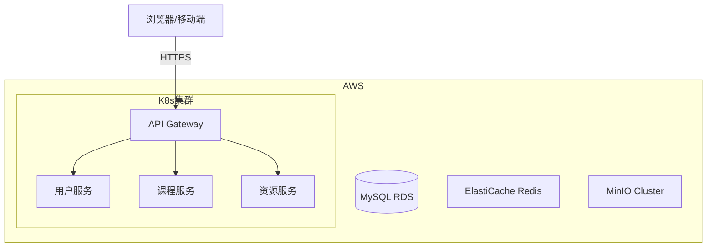

 

## 文档引言
### 编写目的
本文档为总体设计报告（HLD），基于《**软件需求规格说明书**》中的功能与非功能需求，提出清晰的顶层架构设计、模块划分及关键技术实现方案，为后续详细设计、编码、测试和部署提供指导，并作为项目团队的技术共识基准

### 文档范围
**OpenCourse **总体设计报告主要包含了该软件系统整体功能需求的实现及设计方案

### 读者对象
**OpenCourse** 开发团队成员

### 术语表
| **术语** | **定义** |
| --- | --- |
| **体系架构设计** | 软件工程中的高层结构设计，用于定义系统的核心组成部分、各模块间的交互方式以及关键技术选型，关注系统的整体框架，而非具体实现细节 |
| **逻辑架构** | 描述系统的功能模块划分、数据流和交互逻辑，例如分层架构、微服务架构 |
| **物理架构** | 定义系统的部署环境、服务器配置、网络拓扑等硬件相关设计 |
| **技术架构** | 选择编程语言、框架、数据库、中间件等关键技术组件 |
| **分层架构** | 将系统划分为多个水平层，每层承担特定职责，且仅能与其相邻层交互，形成严格的层级调用关系 |
| **客户端-服务器架构** | 通过职责分离将系统划分为客户端（发起请求）和服务器（响应请求）两个核心角色，两者通过网络协议进行通信 |
| **微服务架构** | 将单体应用拆分为一组小型服务，每个服务围绕业务能力独立部署，拥有独立进程和数据存储，通过轻量级协议通信 |
| **事件驱动架构** | 一种以事件为核心的系统设计模式，组件之间通过事件的产生、传递和消费实现松耦合交互 |
| **面向服务架构** | 一种企业级系统集成方法，通过可重用的服务构建灵活、松耦合的分布式系统，服务通过服务总线（ESB）进行通信和组合 |
| **API网关** | 在微服务架构中，用于路由聚合、鉴权、限流等功能的组件 |
| **服务发现** | 在微服务架构中，用于动态服务注册与寻址的组件 |
| **配置中心** | 在微服务架构中，用于统一管理服务配置的组件 |
| **熔断器** | 在微服务架构中，用于防止雪崩效应的组件 |
| **分布式追踪** | 在微服务架构中，用于全链路监控的组件 |
| **事件生产者** | 在事件驱动架构中，生成并发布事件的角色 |
| **事件消费者** | 在事件驱动架构中，订阅并处理事件的角色 |
| **事件通道** | 在事件驱动架构中，传输事件的媒介，如消息队列 |
| **服务总线** | 在面向服务架构中，用于服务通信和组合的中间件 |
| **REST API** | 一种基于HTTP协议的接口设计标准，用于客户端与服务器间交互 |
| **DTO（Data Transfer Object）** | 数据传输对象，用于在不同系统或模块之间传输数据的轻量级对象 |
| **领域模型** | 表示业务实体及其关系的模型，封装了业务逻辑和规则 |
| **CQRS（Command Query Responsibility Segregation）** | 命令查询责任分离模式，将写操作和读操作分离以提高性能 |
| **Event Sourcing（事件溯源）** | 一种通过记录事件来存储系统状态变化的设计模式，支持数据的可追溯性 |
| **API Gateway 模式** | 在微服务架构中，通过API网关统一处理外部请求，实现路由、鉴权等功能 |
| **服务编排（Orchestration）** | 在面向服务架构中，由中央协调器控制服务调用顺序的模式 |
| **服务协同（Choreography）** | 在面向服务架构中，服务间通过事件自主协作的模式 |
| **MinIO** | 一个高性能的分布式对象存储系统，常用于文件存储 |
| **ElastiCache Redis** | 基于AWS的高性能缓存服务，基于Redis实现 |
| **MySQL RDS** | 基于AWS的关系型数据库服务，提供高可用性和可扩展性 |
| **Kubernetes（K8s）** | 一个开源的容器编排平台，用于自动化部署、扩展和管理容器化应用程序 |
| **gRPC** | 一种高性能的远程过程调用框架，支持多种编程语言 |
| **ElasticSearch** | 一个基于Lucene的搜索引擎，用于全文搜索和数据分析 |
| **FFmpeg** | 一个开源的多媒体处理工具，用于音视频的编解码、转换和处理 |
| **Spring Boot** | 一个基于Spring框架的开源Java基础框架，用于创建独立、生产级的基于Spring框架的应用程序 |
| **Spring Security** | 一个功能强大并且高度可定制的Java安全框架，用于保护基于Spring的应用程序 |
| **Spring Data JPA** | 一个用于简化JPA数据访问层实现的Spring框架模块 |
| **Redux Toolkit** | 一个用于构建React应用程序的状态管理库，简化了Redux的使用 |
| **React** | 一个用于构建用户界面的JavaScript库，主要用于开发单页应用程序 |
| **TypeScript** | 一种开源的编程语言，是JavaScript的一个超集，添加了静态类型和其他特性 |
| **VirtualList** | 一种用于优化长列表渲染的React组件，通过虚拟化技术提高性能 |
| **Dropzone** | 一个轻量级的JavaScript库，用于创建拖放文件上传区域 |


---

## 体系架构设计
### 设计目的
**体系架构设计**（System Architecture Design）是软件工程中的高层结构设计，用于定义系统的核心组成部分、各模块间的交互方式以及关键技术选型，它关注的是系统的整体框架，而非具体实现细节，旨在提供一个可扩展、可维护且符合业务需求的软件结构

体系架构设计通常包括：

+ **逻辑架构**：描述系统的功能模块划分、数据流和交互逻辑（如分层架构、微服务架构）
+ **物理架构**：定义系统的部署环境、服务器配置、网络拓扑等硬件相关设计
+ **技术架构**：选择编程语言、框架、数据库、中间件等关键技术组件

体系架构设计是连接需求分析与详细设计的桥梁，它将业务需求转化为可实现的技术方案，为后续开发提供明确的指导方向，通过合理的架构设计，可以确保系统在满足当前需求的同时，具备良好的可扩展性和可维护性，为未来的功能演进奠定基础

#### 设计目标
本系统的体系架构设计主要基于《软件需求规格说明书》中的功能与非功能需求，旨在实现以下目标：  

1. 提供清晰的技术蓝图，明确系统的整体结构，确保开发团队对系统组成和交互方式有统一理解，避免因理解偏差导致的实现错误
2. 支持模块化与高内聚低耦合，通过合理的模块划分，降低系统复杂度，使各模块职责单一、易于维护和扩展
3. 满足非功能性需求，针对性能、安全性、可扩展性等需求，设计相应的架构策略（如负载均衡、分布式缓存、数据分片等）
4. 确保技术可行性，通过技术选型评估（如数据库性能测试、框架对比），验证架构方案的可行性，规避潜在技术风险
5. 优化资源利用，合理规划计算、存储和网络资源（如云服务选型、容器化部署），降低运维成本
6. 便于团队协作，定义清晰的接口规范（如REST API、消息队列协议），使不同团队（前端、后端、测试）能并行开发
7. 适应未来演进，采用可扩展的架构模式（如插件化设计、松耦合服务），确保系统能灵活应对业务需求变化

#### 设计原则
本系统的体系架构设计应该遵循以下原则：

+ **可扩展性**：体系架构设计确保软件系统系统设计是可扩展的，以适应不断变化的业务需求
+ **可维护性**：体系架构设计应该结构清晰，易于维护， 随着时间推移修改或版本更新迭代不会对系统造成任何中断影响
+ **可重用性**：体系架构设计确保软件系统的设计可以进行复用，提高软件质量
+ **可靠性**：体系架构确保软件系统的设计是可靠的，能够避免重大的系统故障
+ **安全性**：体系架构确保软件系统的设计是安全的，能够支持身份认证、授权和加密功能

#### **输出成果**
本系统的体系架构设计将输出以下内容：  

+ 系统架构图（逻辑视图、部署视图）
+ 模块划分及接口定义
+ 关键技术选型说明（如数据库、缓存、消息队列）  
+ 非功能需求的实现方案（如性能优化策略）

以上设计成果将为团队提供完整的技术支持与指导，确保系统开发按照既定的架构方向顺利进行

### 架构分类
#### 分层架构
分层架构（Layered Architecture）通过将系统划分为多个水平层，每层承担特定职责，且仅能与其相邻层交互，形成严格的层级调用关系。这种架构通过关注点分离（Separation of Concerns）实现高内聚、低耦合的设计目标

| 层级 | 职责 | 技术实现示例 |
| --- | --- | --- |
| **表现层** | 用户交互与数据展示 | Web（React/Vue）、移动端（Flutter）、Thymeleaf模板 |
| **业务逻辑层** | 核心业务规则处理 | Spring @Service、领域模型（Domain Model） |
| **数据访问层** | 数据持久化与存储抽象 | JPA/Hibernate、MyBatis、JDBC |
| **数据库层** | 数据存储 | MySQL、MongoDB、Redis |


分层架构的关键优势在于：

+ **可维护性**：修改某一层不影响其他层（如更换UI框架不影响业务逻辑）
+ **可测试性**：可逐层进行单元测试（Mock下层依赖）
+ **技术异构**：每层可采用不同技术栈（如表现层用Vue，业务层用Java）
+ **团队协作**：不同团队负责不同层次开发

当然也存在潜在缺点：

+ **性能损耗**：跨层调用可能增加延迟（尤其严格分层）
+ **层级僵化**：过度分层会导致简单任务流程冗长
+ **分布式瓶颈**：传统分层架构通常为单体部署，难以直接扩展单层

综合以上，其适用场景通常是

+ 传统企业管理系统（OA、ERP、CRM）
+ 需要快速验证的业务原型开发
+ 团队技能矩阵分层明确（如前端/后端工程师分离）

#### 客户端-服务器架构
**客户端-服务端**（Client-Server Architecture）架构通过**职责分离**将系统划分为两个核心角色：  

+ **客户端（Client）**：发起请求，处理用户交互与数据展示（"请求方"）  
+ **服务器（Server）**：响应请求，提供核心业务逻辑与数据存储（"服务方"）

两者通过**网络协议**进行通信，典型特征为**集中式数据管理**

| 关键特性 | 客户端 | 服务器 |
| --- | --- | --- |
| **职责** | 用户界面/交互逻辑 | 数据处理/业务规则 |
| **部署位置** | 用户设备（PC/手机等） | 远程主机（云服务器/本地机房） |
| **资源消耗** | 依赖用户设备性能 | 需高可用、高并发能力 |
| **典型技术** | HTML/Android/iOS/Electron | Java Spring/Node.js/.NET Core |


| 通信模式 | 协议/技术 | 适用场景 |
| --- | --- | --- |
| **请求-响应** | HTTP/REST、gRPC | 网页/移动端API调用 |
| **持久连接** | WebSocket、TCP长连接 | 实时聊天、股票行情推送 |
| **数据同步** | MQTT、Firebase Realtime DB | 物联网设备数据同步 |


架构变体有多种：

1. **两层架构（2-Tier）**  
    - 结构：`Client → Database Server`  
    - 示例：早期VB/PB开发的C/S系统，客户端直接连接数据库  
    - 缺点：业务逻辑混在客户端或数据库存储过程中，难以维护
2. **三层架构（3-Tier）**  
    - 结构：`Client → Application Server → Database Server`  
    - 现代主流模式，业务逻辑独立到应用服务器  
    - 示例：前端React + 后端Spring Boot + MySQL
3. **多层架构（N-Tier）**  
    - 扩展三层架构，增加缓存层、消息队列等中间件  
    - 示例：`Client → API Gateway → Microservices → Redis → MySQL`

它的核心优势在于：

+ **集中化管理**：数据和服务统一维护，安全性高（如银行系统）  
+ **资源高效利用**：服务器可集中处理复杂计算，客户端设备要求低  
+ **可扩展性**：服务器可水平扩展（如负载均衡集群）  
+ **跨平台性**：多种客户端可共享同一后端（如Web/iOS/Android共用API）

而面临的主要挑战包括：

+ **单点故障风险**：服务器宕机导致全线服务中断（需高可用设计）  
+ **网络依赖**：弱网环境下体验下降（需离线模式设计）  
+ **性能瓶颈**：高并发时服务器压力大（需缓存/异步优化）  
+ **版本兼容**：客户端强制升级问题（需API版本控制）

综合以上，客户端-服务端架构适用于：

+ ✅ **企业级应用**：ERP、OA系统（集中式数据管理）  
+ ✅ **内容服务**：新闻/视频网站（内容统一发布）  
+ ✅ **轻量级IoT**：智能家居设备控制（终端设备资源有限）  
+ ❌ 不适合**完全离线**或**对等网络**需求场景（如区块链P2P应用）

#### 微服务架构
**微服务架构**（Microservices Architecture）将单体应用拆分为**一组小型服务**的架构风格，每个服务：  

+ 围绕**业务能力**独立部署（如订单服务、支付服务）  
+ 拥有**独立进程**和**数据存储**  
+ 通过**轻量级协议**通信（HTTP/RPC）  
+ 可由不同团队**独立开发运维**

相较于传统的单体架构，微服务架构有很多优势，如：

| 特性 | 微服务架构 | 传统单体架构 |
| --- | --- | --- |
| **代码库** | 每个服务独立代码库 | 单一共享代码库 |
| **数据存储** | 私有数据库（Polyglot Persistence） | 集中式数据库 |
| **部署单元** | 独立服务可单独部署 | 整体应用打包部署 |
| **技术多样性** | 允许混合技术栈（如Java+Go） | 通常统一技术栈 |
| **容错能力** | 故障隔离（一个服务宕机不影响其他） | 单点故障导致整个系统崩溃 |


核心组件与技术栈通常为

| 组件 | 功能 | 主流实现方案 |
| --- | --- | --- |
| **API网关** | 路由聚合、鉴权、限流 | Kong/Nginx/Spring Cloud Gateway |
| **服务发现** | 动态服务注册与寻址 | Eureka/Consul/Zookeeper |
| **配置中心** | 统一管理服务配置 | Spring Cloud Config/Apollo |
| **熔断器** | 防止雪崩效应 | Hystrix/Sentinel |
| **分布式追踪** | 全链路监控 | Zipkin/SkyWalking/Jaeger |


微服务架构的核心优势在于：

+ **敏捷交付**：不同服务可独立迭代（如订单服务每周发版，支付服务每月发版）  
+ **技术自由**：根据服务特性选择合适技术（如AI服务用Python，交易服务用Java）  
+ **弹性扩展**：按需扩展热点服务（如大促时单独扩容秒杀服务）  
+ **容错性**：单个服务故障不影响全局（通过熔断降级机制）

而实施挑战包括：

+ **分布式复杂度**：  
    - 数据一致性（需引入Saga/TCC模式）  
    - 跨服务事务（最终一致性替代强一致性）
+ **运维成本**：  
    - 需完整的CI/CD流水线（如Jenkins+ArgoCD）  
    - 日志聚合与监控体系（ELK+Prometheus+Grafana）
+ **网络延迟**：服务间通信带来额外开销（需gRPC优化）

基于此，其适用场景为

+ ✅ **高复杂度系统**：电商平台（商品、订单、支付等模块独立演进）  
+ ✅ **多团队协作**：200人以上研发团队并行开发  
+ ✅ **混合云部署**：不同服务部署到不同云厂商（合规要求）  
+ ❌ 不适合**小型项目**（团队<10人）或**低延迟强一致性**系统（如金融核心交易）

#### 事件驱动架构
**事件驱动架构**（Event-Driven Architecture, EDA）是一种以**事件（Event）****为核心的系统设计模式，组件之间通过****事件的产生、传递和消费**实现松耦合交互

相比传统的请求-响应模式，EDA 更适用于**异步、实时、高并发**的场景

事件驱动架构的核心概念有：

1. 事件（Event）
    - **定义**：系统中发生的状态变化或重要动作的**通知**（如“订单已创建”、“支付成功”） 
    - **特点**：
        * **不可变（Immutable）**：事件发生后不可修改，只能追加新事件
        * **轻量级**：通常只包含必要数据（如 `order_id`, `timestamp`）
        * **可持久化**：支持事件溯源（Event Sourcing）
2. 关键角色

| 角色 | 职责 | 示例 |
| --- | --- | --- |
| **事件生产者（Producer）** | 生成并发布事件 | 订单服务（发布 `OrderCreated` 事件） |
| **事件消费者（Consumer）** | 订阅并处理事件 | 库存服务（监听 `OrderCreated` 扣减库存） |
| **事件通道（Event Channel）** | 传输事件的媒介 | Kafka / RabbitMQ / AWS EventBridge |


对应的架构模式包括：

1. 代理模式（Broker Pattern）
    - **特点**：事件通过消息中间件（Broker）传递，生产者和消费者解耦。
    - **适用场景**：需要高可靠、可扩展的事件分发（如电商订单处理）。
2. 中介模式（Mediator Pattern）
    - **特点**：引入**事件编排引擎**（如 AWS Step Functions）管理复杂事件流。
    - **适用场景**：需要跨服务协调的业务流程（如机票预订：支付+出票+通知）。

事件驱动架构的核心优势在于：

1. **松耦合**：服务间不直接依赖，仅通过事件交互。
2. **高扩展性**：消费者可独立伸缩（如库存服务单独扩容）。
3. **实时响应**：适合流式数据处理（如实时风控、IoT 传感器分析）。
4. **容错性**：事件可重放（Kafka 持久化），故障后恢复容易。

而对应的挑战包括：

1. **事件顺序问题**：需保证事件顺序（如 `订单创建` → `支付` → `发货`）。
2. **数据一致性**：最终一致性（需 Saga 模式补偿事务）。
3. **调试复杂**：分布式追踪困难（需 Zipkin/Jaeger）。
4. **消息积压**：消费者处理慢时可能堆积（需监控 + 自动扩缩容）。

基于此，其适用场景为：

| 场景 | 案例 |
| --- | --- |
| **实时数据处理** | 股票交易、IoT 设备监控 |
| **异步任务编排** | 电商订单流程（支付→库存→物流） |
| **事件溯源（Event Sourcing）** | 银行账户流水、审计日志 |
| **CQRS（读写分离）** | 高并发查询（如微博动态流） |


#### 面向服务架构
**面向服务架构**（Service-Oriented Architecture, SOA）是一种**企业级系统集成**方法，通过**可重用的服务（Service）构建灵活、松耦合的分布式系统。其核心思想是将业务功能封装为标准化服务**，并通过服务总线（ESB）进行通信和组合

其架构模式主要可以分为：

1. 服务编排（Orchestration）
    - **特点**：由**中央协调器**（如 BPEL 引擎）控制服务调用顺序
    - **适用场景**：需要严格流程控制的业务（如银行开户：验证→审批→开户）
2. 服务协同（Choreography）
    - **特点**：服务间**通过事件自主协作**，无中央控制器
    - **适用场景**：灵活、去中心化的流程（如物流跟踪：订单→仓库→配送）

面向服务架构的核心优势在于

1. **业务敏捷性**：服务可重组支持新业务流程（如快速上线促销活动）  
2. **技术异构**：不同服务可用不同语言/平台（如 Java + .NET 共存）  
3. **重用性**：避免重复开发（如统一支付服务供多个系统调用）

同时，其面临的挑战有：

1. **ESB 单点故障**：总线崩溃可能导致系统瘫痪（需高可用设计）
2. **性能开销**：XML/SOAP 协议比二进制通信（如 gRPC）慢
3. **治理复杂**：需统一管理服务版本、SLA、安全策略

综合以上，其适用场景有

| 场景 | 案例 |
| --- | --- |
| **企业应用集成（EAI）** | 合并 ERP、CRM 等遗留系统 |
| **跨部门协作** | 医院挂号系统（对接门诊、药房、财务） |
| **混合云部署** | 本地服务 + 公有云服务组合 |


相比于微服务架构，二者的区别体现在

| 维度 | SOA | 微服务 |
| --- | --- | --- |
| **核心目标** | 企业系统集成 | 敏捷交付独立功能 |
| **通信方式** | 集中式（ESB） | 去中心化（API Gateway） |
| **服务粒度** | 粗粒度（如“客户管理服务”） | 细粒度（如“地址校验服务”） |
| **技术约束** | 通常强制统一标准（如 SOAP） | 允许技术多样性 |


### 架构选型
综合以上的架构类型，本系统采用的核心体系架构为**分层架构**，同时兼有**微服务架构**和**客户端-服务端架构**、**事件驱动架构**和**面向服务架构**的特征

---

## 模块设计
### **服务端设计**
#### **服务端架构设计**
本系统采用**分层架构**，结合**微服务设计理念**，将核心业务拆分为独立可扩展的模块，确保高内聚低耦合

总体上，服务端架构自顶向下分为以下四层：

+ 控制层（Controller）
+ 服务层（Service）
+ 映射层（Mapper）
+ 模型层（Model）

##### 控制层
控制层负责处理客户端的 HTTP 请求，协调业务逻辑处理，从请求中提取必要的信息和数据并返回响应，主要内容包括：

1. **请求路由与分发**
    - 定义 API 端点：通过注解（如`@RestController`、`@RequestMapping`）映射 HTTP 请求路径到具体方法
    - 支持多种请求方式：区分`GET`/`POST`/`PUT`等 HTTP 方法

```java
@PostMapping("/api/users")
public ResponseEntity<User> createUser(@RequestBody UserDTO userDto) {
    // 调用 Service 层处理
}
```

2. **参数处理与验证**
    - 解析输入数据：自动绑定 URL 参数、请求体（JSON/XML）、表单数据到 Java 对象
    - 数据校验：结合校验注解（如`@Valid`、`@NotBlank`）确保参数合法性

```java
@GetMapping("/api/resources")
public List<Resource> getResources(
    @RequestParam String courseId, 
    @RequestParam(required=false) Integer page
) { ... }
```

3. **调用服务层逻辑**
    - 协调业务处理逻辑：将请求委托给**服务层**执行具体业务逻辑

```java
@Autowired
private UserService userService;

@PostMapping("/login")
public ResponseEntity<String> login(@Valid @RequestBody LoginDTO dto) {
    String token = userService.authenticate(dto); // 调用 Service
    return ResponseEntity.ok(token);
}
```

4. **响应封装与转换**
    - 统一响应格式：将**服务层**返回数据封装为 HTTP 响应（JSON/XML），设置状态码、Header 等
    - 异常处理：捕获**服务层**抛出的异常，转换为用户友好的错误响应（如 404 Not Found）

```java
@GetMapping("/api/courses/{id}")
public ResponseEntity<Course> getCourse(@PathVariable String id) {
    Course course = courseService.findById(id);
    return ResponseEntity.ok().cacheControl(CacheControl.maxAge(1, HOURS)).body(course);
}
```

5. **安全控制**
    - 权限验证：通过拦截器或注解（如`@PreAuthorize`）实现接口访问控制

```java
@DeleteMapping("/admin/users/{id}")
@PreAuthorize("hasRole('ADMIN')") // 仅管理员可访问
public void deleteUser(@PathVariable String id) { ... }
```

6. **跨领域关注点**
    - 日志记录：记录请求入参、响应结果等
    - 限流与监控：系统流量管理与网络检测

##### 服务层
服务层是业务逻辑的核心承载层，介于控制层和映射层之间，主要职责包括

1. **封装核心业务逻辑**：将复杂的业务逻辑集中管理，避免控制层臃肿

```java
public class OrderService {
    public Order createOrder(Cart cart, User user) {
        // 校验库存、计算折扣、生成订单号等
    }
}
```

2. **协调事务管理**：保证跨数据库操作的原子性

```java
@Transactional
public void transferMoney(String from, String to, BigDecimal amount) {
    accountRepository.debit(from, amount);
    accountRepository.credit(to, amount);
}
```

3. **数据转换与聚合**：将**映射层**的持久化数据实体转化为面向客户端的数据传输对象（DTO）

```java
public UserDTO getUserProfile(Long id) {
    User user = userRepository.findById(id);
    return UserDTO.builder()
        .name(user.getName())
        .email(user.getMaskedEmail()) // 脱敏处理
        .build();
}
```

4. **调用外部服务**：集成第三方 API，封装外部调用 API，统一处理异常和重试逻辑

```java
public String sendVerificationCode(String phone) {
    try {
        return smsClient.send(phone, "您的验证码是: " + generateCode());
    } catch (SmsException e) {
        throw new BusinessException("短信发送失败，请重试");
    }
}
```

5. **缓存与性能优化**：基于缓存减少重复计算与数据库查询，优化性能

```java
@Cacheable(value = "hotCourses", key = "#category")
public List<Course> getHotCourses(String category) {
    return courseRepository.findTop10ByCategoryOrderByPopularityDesc(category);
}
```

6. **安全性控制**：补充**映射层**的粗粒度权限控制

```java
public void deleteComment(Long commentId, Long currentUserId) {
    Comment comment = commentRepository.findById(commentId);
    if (!comment.getUserId().equals(currentUserId)) {
        throw new UnauthorizedException("无权删除此评论");
    }
    commentRepository.delete(comment);
}
```

##### 映射层
映射层负责在不同数据模型之间进行转换，主要解决数据对象在应用各层之间的格式差异作用，连接服务层和模型层，主要职责包括：

1. **隔离领域模型与持久化模型**：将数据库实体（Entity） 转化为服务层使用的领域对象（Domain），或反向转化，避免业务代码直接依赖数据库表结构

```java
public UserDomain toDomain(UserEntity entity) {
    return UserDomain.builder()
        .id(entity.getId())
        .name(entity.getUsername())
        .build();
}
```

2. **屏蔽数据结构差异**：将内部领域对象转化为面向外部的数据传输对象（DTO），隐藏敏感字段和复杂逻辑

```java
public UserResponseDTO toDTO(UserDomain domain) {
    return UserResponseDTO.builder()
        .userId(domain.getId())
        .displayName(domain.getName())
        .maskedPhone("*******" + domain.getPhone().substring(7))
        .build();
}
```

3. **简化多数据源整合**：合并数据库、API、缓存等不同来源数据，统一为服务层可用的模型

```java
public UserProfile toProfile(UserEntity user, SocialInfo social) {
    return UserProfile.builder()
        .basicInfo(toDomain(user))
        .socialMedia(social.getLinks())
        .build();
}
```

##### 模型层
模型层是服务端架构中承载核心业务数据和规则的层次，用于抽象实现业务中的实体、关系和约束，核心作用包括：

1. **定义业务实体与数据结构**：抽象业务核心实体，构建业务属性与基本校验逻辑

```java
public class User {
    private Long id;
    @Email private String email;  // 业务校验
    private List<Order> orders;   // 关联关系
}
```

2. **封装业务逻辑与行为**：将业务操作封装为模型方法

```java
public class Order {
    public void applyDiscount(Coupon coupon) {
        if (coupon.isValid()) {
            this.totalAmount -= coupon.getAmount();  // 计算折扣
        }
    }
}
```

3. **隔离持久化细节**：通过**映射层**实现与持久化对象的转换
4. **支持多场景数据表示**：同一业务实体在不同场景下表现为不同形态
5. **保证数据一致性**：在模型内部强制业务规则

```java
public class Order {
    private OrderStatus status;
    
    public void cancel() {
        if (status != OrderStatus.PAID) {  // 规则校验
            throw new IllegalStateException("仅可取消已支付订单");
        }
        this.status = OrderStatus.CANCELLED;
    }
}
```

#### **服务端模块设计**
服务端的总体功能描述如下：

| 服务名称 | 职责描述 | 技术实现 |
| --- | --- | --- |
| 用户服务 | 学籍验证注册、权限管理、贡献值计算 | Spring Boot + Spring Security |
| 课程服务 | 课程结构化录入、资源版本控制、课程关注推送 | Spring Data JPA + ElasticSearch |
| 资源服务 | 文件存储（MinIO）、自动化格式转换（PPT→PDF）、水印嵌入 | FFmpeg集成 + MinIO SDK |
| 互动服务 | 热评加权算法（点赞数×时间衰减因子）、匿名提问箱、成就系统 | Redis SortedSet + 分布式锁 |
| 学习助手服务 | 大模型接口封装（DeepSeek）、语义解析、检索结果融合 | gRPC + ElasticSearch DSL构建 |


##### **用户服务**
+ **类图设计**  

```puml
class User {
  -String userId
  -String encryptedPassword
  -int contribution
  +register(SchoolEmail email)
  +login(String studentId, String password)
}
class PermissionManager {
  -Map<Role, Set<Permission>> rolePermissions
  +validatePermission(User user, String resource)
}
User --> PermissionManager : 权限校验
```

+ **核心接口**  

| 接口名称 | HTTP方法 | 路径 | 描述 |
| --- | --- | --- | --- |
| 用户注册 | `POST` | `/api/user/register` | 需邮箱验证码二次确认 |
| 贡献值查询 | `GET` | `/api/user/contrib` | 返回排行榜前100名 |
| 权限动态分配 | `PUT` | `/api/user/role` | 系统管理员操作接口 |


##### 课程服务
```sql
CREATE TABLE courses (
  course_id VARCHAR(20) PRIMARY KEY,
  name VARCHAR(100) NOT NULL,
  department VARCHAR(50),
  metadata JSON  -- 存储动态字段（如学分、教师）
);

CREATE TABLE resources (
  resource_id VARCHAR(36) PRIMARY KEY,
  course_id VARCHAR(20) REFERENCES courses(course_id),
  type ENUM('PPT', 'HOMEWORK', 'EXAM', 'NOTE'),
  minio_path VARCHAR(255) NOT NULL,
  current_version_id VARCHAR(36)
);

CREATE TABLE resource_versions (
  version_id VARCHAR(36) PRIMARY KEY,
  resource_id VARCHAR(36) REFERENCES resources(resource_id),
  uploader_id VARCHAR(36) NOT NULL,
  upload_time DATETIME DEFAULT CURRENT_TIMESTAMP
);
```

##### **资源服务**


##### 互动服务


##### 学习助手服务


### **客户端设计**
#### **客户端架构设计**
客户端架构对应视图层(View)，是系统体系架构中的最顶层，负责将服务端的数据与响应转化为反馈给客户端的用户友好的数据和界面显示


采用 **React 18 + TypeScript **实现组件化开发，状态管理使用 Redux Toolkit ，整体结构如下：

```shell
src/
├── views/               # 页面级组件
│   ├── Course/          # 课程详情页
│   └── Resource/        # 资源上传页
├── features/            # 功能模块
│   ├── auth/            # 登录注册
│   └── comment/         # 评论功能
├── components/          # 通用组件
│   ├── ui/              # 基础UI（按钮/输入框）
│   └── business/        # 业务组件（资源卡片）
├── hooks/               # 自定义Hook
├── store/               # 全局状态
└── services/            # API客户端
```

#### **核心交互设计**
##### **资源上传组件**
:::color2
**3-Click 交互流程**：

1. 点击"上传"按钮 → 弹出课程选择器  
2. 选择课程/资源类型 → 拖放文件区域激活  
3. 文件拖放完成 → 自动触发转换并显示预览

:::

```tsx
const ResourceUpload = () => {
  const [file, setFile] = useState<File>();
  const { courseId } = useParams();

  const handleUpload = async () => {
    const { url } = await getPresignedUrl(courseId); 
    await axios.put(url, file); // 直传MinIO
    showSuccessToast("上传成功！");
  };

  return (
    <Dropzone onDrop={files => setFile(files[0])}>
      {({ getRootProps }) => (
      <div {...getRootProps()}>
        <Button icon={<UploadOutlined />}>拖放文件至此</Button>
      </div>
    )}
    </Dropzone>
  );
};
```

##### **热评排序算法**
```typescript
const calculateHotScore = (likes: number, timestamp: number) => {
  const hoursElapsed = (Date.now() - timestamp) / (1000 * 3600);
  return likes * Math.exp(-0.1 * hoursElapsed); // 时间衰减因子
};
```

```tsx
<VirtualList
  data={sortedComments}
  itemHeight={80}
  renderItem={(comment) => <CommentCard {...comment} />}
/>
```

#### **兼容性适配**
```jsx
"browserslist": [
  ">0.2%",
  "not dead",
  "Chrome >= 60",
  "Safari >= 12",
  "iOS >= 12",
  "Firefox ESR"
]
```

```css
.course-grid {
  display: grid;
  grid-template-columns: repeat(auto-fill, minmax(300px, 1fr));
  @media (max-width: 768px) {
    grid-template-columns: 1fr; 
  }
}
```

---

## 部署架构
### 物理部署拓扑


### 资源配置
| 组件 | 规格 | 数量 | 说明 |
| --- | --- | --- | --- |
| API Gateway | t3.medium 2vCPU | 2 | 自动扩缩容策略 |
| 业务服务 | t3.large 4vCPU | 4 | 按负载动态调整 |
| MySQL | db.m5.xlarge | 1 | 读写分离代理 |
| Redis | cache.r5.large | 2 | 哨兵模式高可用 |


---

## 接口规范
采用 **REST API** 设计标准设计接口规范

+ **响应格式**  

```json
{
  "code": 200,
  "data": {
    "courseId": "CS101",
    "name": "软件工程"
  },
  "message": "success"
}
```

+ **错误码定义**  

| 状态码 | 含义 |
| --- | --- |
| 401 | 未授权访问 |
| 403 | 权限不足 |
| 429 | 请求过于频繁 |


